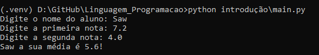

# Linguagem de Programação

## Conceito Geral
### Este repositório apresenta uma visão geral sobre a minha interpretação como entusiasta da linguagem python, baseada nos tópicos abordados no ebook disponibilizado no módulo de Linguagem de Programação da Universidade São Francisco. Os códigos e algoritmos desenvolvidos a seguir refletem minha interpretação pessoal e não devem ser considerados como uma avaliação ou representação da qualidade do conteúdo do ebook.
#### Dito isso, erros técnicos podem estar presentes, pois este é um trabalho de estudo e aprendizado individual. Fique à vontade para compartilhar quaisquer conhecimentos relacionados à matéria!

## Comandos de Entrada e Saída

### Código 1

[Ver o Algoritmo](./introdução/main.py)

#### Entrada
- `name: str`  
- `nota1: float`  
- `nota2: float`  

#### Saída

